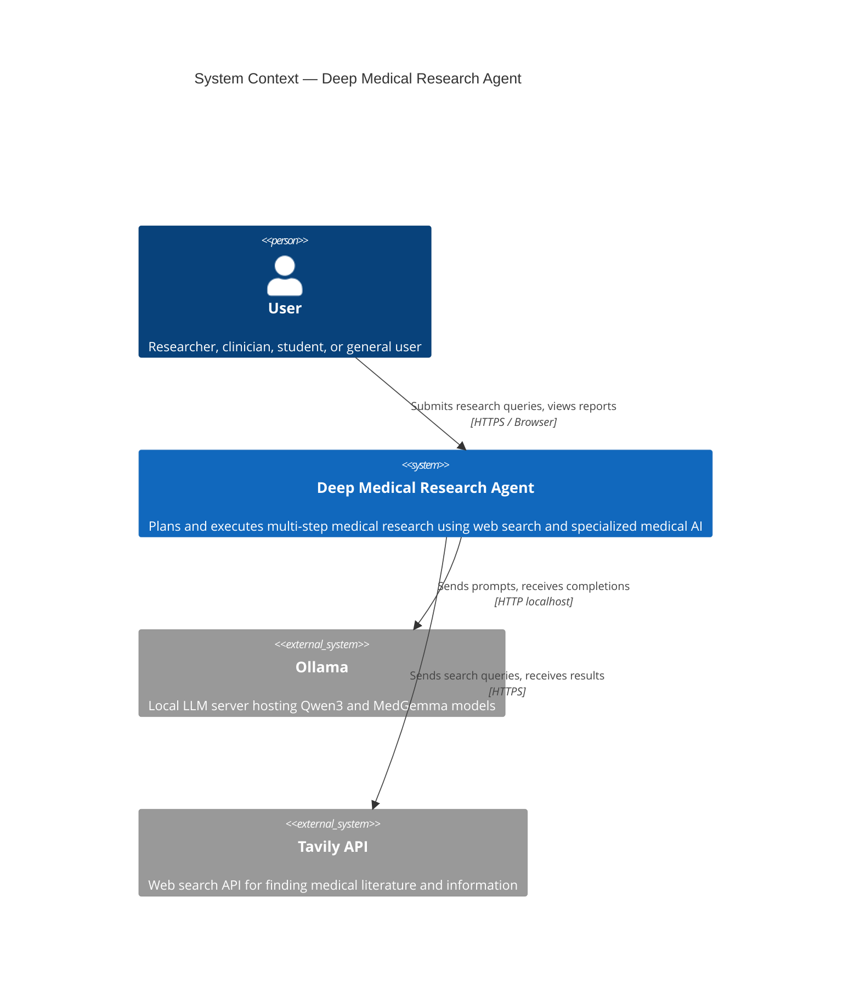
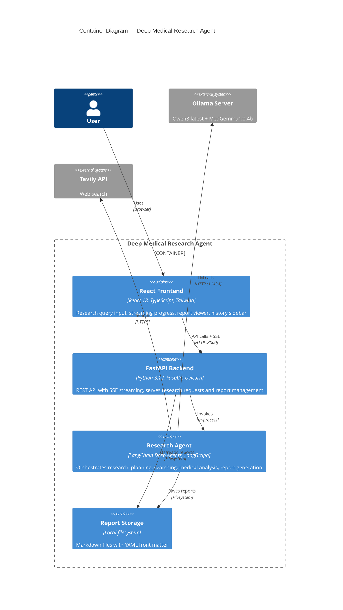
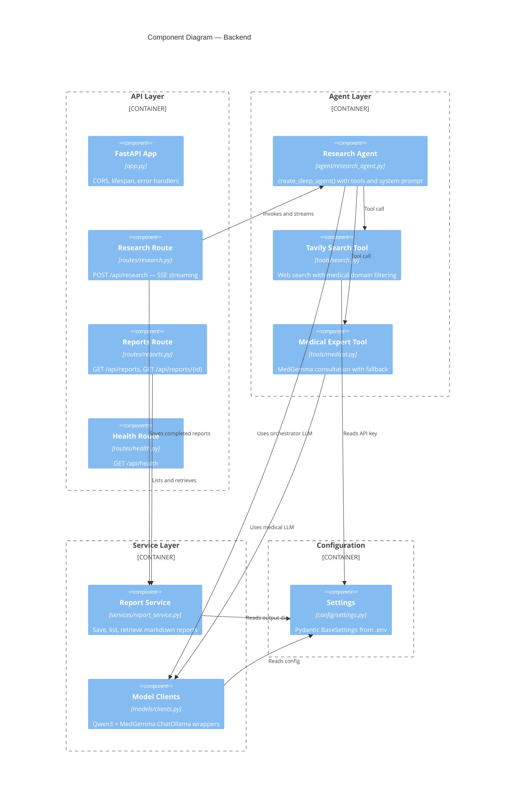

# Architecture: Deep Medical Research Agent

## C4 Context Diagram



## C4 Container Diagram



## C4 Component Diagram — Backend



## Data Flow

```
User Query
    │
    ▼
┌─────────────┐    SSE Stream    ┌──────────────────┐
│  React UI   │ ◄──────────────► │  FastAPI Backend  │
│  :5173      │    POST /api/    │  :8000            │
└─────────────┘    research      └────────┬─────────┘
                                          │
                                          ▼
                                ┌─────────────────────┐
                                │  Deep Research Agent │
                                │  (LangGraph loop)    │
                                └──┬──────┬──────┬────┘
                                   │      │      │
                          ┌────────┘      │      └────────┐
                          ▼               ▼               ▼
                   ┌───────────┐  ┌────────────┐  ┌──────────┐
                   │  Tavily   │  │  MedGemma  │  │  Report  │
                   │  Search   │  │  Expert    │  │  Storage │
                   │  (HTTPS)  │  │  (Ollama)  │  │  (files) │
                   └───────────┘  └────────────┘  └──────────┘
```

## Key Architectural Decisions

| Decision | Choice | Rationale |
|----------|--------|-----------|
| Agent framework | LangChain Deep Agents | Built-in planning, sub-agents, filesystem; built on LangGraph |
| Orchestrator model | Qwen3 via Ollama | Supports tool calling, runs locally, free |
| Medical specialist | MedGemma via Ollama | Purpose-built for medical text, no tool calling needed |
| Search provider | Tavily | LangChain integration, domain filtering, structured results |
| API streaming | Server-Sent Events | Simpler than WebSockets for unidirectional streaming |
| Report storage | Markdown files | Simple, portable, human-readable, no database needed |
| Frontend | React + Vite | Fast dev experience, TypeScript support, Tailwind for styling |

## Module Structure

```
src/
├── __init__.py
├── __main__.py              # Entry point
├── config/
│   ├── __init__.py
│   └── settings.py          # Pydantic BaseSettings
├── models/
│   ├── __init__.py
│   └── clients.py           # Qwen3 + MedGemma client factories
├── tools/
│   ├── __init__.py
│   ├── search.py            # Tavily search tool
│   └── medical.py           # Medical expert consultation tool
├── agent/
│   ├── __init__.py
│   └── research_agent.py    # create_deep_agent() assembly
├── services/
│   ├── __init__.py
│   └── report_service.py    # Report save/list/retrieve
└── api/
    ├── __init__.py
    ├── app.py               # FastAPI app factory
    ├── schemas.py            # Pydantic request/response models
    └── routes/
        ├── __init__.py
        ├── health.py         # GET /api/health
        ├── research.py       # POST /api/research (SSE)
        └── reports.py        # GET /api/reports

frontend/
├── src/
│   ├── App.tsx
│   ├── components/
│   │   ├── ResearchInput.tsx
│   │   ├── ProgressLog.tsx
│   │   ├── ReportViewer.tsx
│   │   └── HistorySidebar.tsx
│   ├── api/
│   │   └── client.ts
│   └── types/
│       └── index.ts
├── package.json
├── tsconfig.json
├── tailwind.config.js
└── vite.config.ts
```
